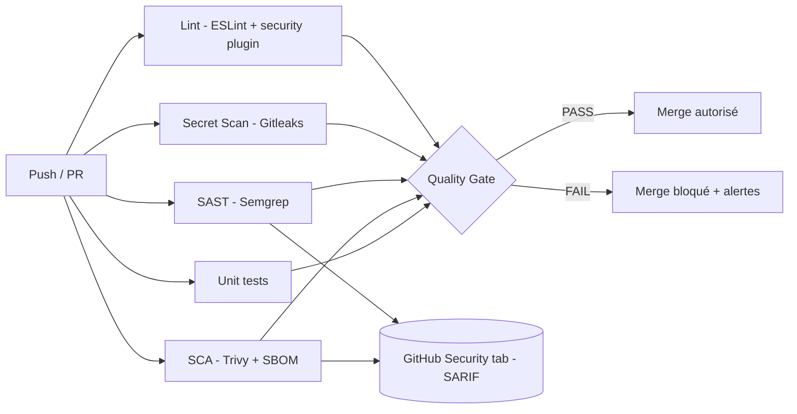

# DevSecOps Pipeline Template - Secure CI/CD by Default

> **Audience** : RSSI / CISO, Heads of Engineering, Auditeurs SOC 2 / ISO 27001, Lead Developers.
> **Objet** : Modèle de pipeline CI/CD GitHub Actions intégrant les contrôles de sécurité obligatoires de l'organisation, conçu pour réduire la dette technique de sécurité et fournir des preuves d'audit (*evidence*) reproductibles.

[](https://github.com/projetseyes-dev/DevSecOps-Pipeline--GitHub-Actions-/actions/workflows/devsecops-pipeline.yml)
[](https://github.com/projetseyes-dev/DevSecOps-Pipeline--GitHub-Actions-/actions/workflows/devsecops-pipeline.yml)
[](./docs/policy/SECURITY_STANDARDS.md)
[](./docs/policy/SECURITY_STANDARDS.md)

---

## 1. Vision & Positionnement Stratégique

Ce dépôt est un **template d'organisation** (`.github` template) destiné à être consommé par toutes les nouvelles applications. Il matérialise la stratégie « **Shift-Left Security** » : la sécurité n'est plus une étape gate-keeper en fin de cycle, mais un *contrôle automatique, traçable et bloquant* exécuté à chaque commit et chaque pull request.

L'objectif n'est pas de produire un rapport de sécurité supplémentaire, il est de **rendre impossible la livraison de code non conforme** aux standards de l'organisation.

### Principes directeurs

| Principe                       | Application concrète dans ce template                               |
|-------------------------------|----------------------------------------------------------------------|
| Security as Code               | Tous les contrôles vivent dans le repo, versionnés, code-reviewed. |
| Fail closed (deny by default)  | Le pipeline échoue si la moindre vulnérabilité Critical/High est détectée. |
| Provable & auditable           | Chaque exécution produit des artefacts SARIF + SBOM conservés 30-90 jours. |
| Least privilege                | `permissions: contents: read` au niveau du workflow, élévation par job. |
| Reproducibility                | `npm ci`, versions d'actions épinglées, scans hebdomadaires planifiés. |

---

## 2. Architecture du Pipeline



Cinq jobs s'exécutent **en parallèle** pour minimiser la durée du feedback (~3-5 min sur un repo de taille moyenne), suivis d'un job d'agrégation **`quality-gate`** qui consolide la décision GO/NO-GO.

---

## 3. Contrôles de sécurité implémentés

| # | Contrôle           | Outil   | Type    | Politique d'échec                                                                 |
|---|---------------------|---------|---------|----------------------------------------------------------------------------------|
| 1 | Linting & Code Quality | ESLint + `eslint-plugin-security` | Static | Toute erreur ESLint ; règles de sécurité élevées au niveau `error`. |
| 2 | Secret Scanning     | Gitleaks | Static | Toute fuite de secret détectée (full git history). |
| 3 | SAST                | Semgrep | Static | Toute findings de sévérité `ERROR` (mappée sur Critical/High OWASP). |
| 4 | SCA / Dependency Check | Trivy   | Composition | Toute CVE de sévérité `CRITICAL` ou `HIGH`. |
| 5 | Misconfiguration & IaC | Trivy   | Composition | Inclus dans le scan Trivy (`scanners: vuln,secret,misconfig`). |
| 6 | SBOM                | Trivy (CycloneDX) | Inventaire | Généré à chaque build, archivé 90 jours. |

> Voir le détail des règles dans [`docs/policy/SECURITY_STANDARDS.md`](./docs/policy/SECURITY_STANDARDS.md).

---

## 4. Le Quality Gate - la piece centrale

Le pipeline implémente un **Quality Gate strict**. La règle est simple et non négociable :

> **Toute vulnérabilité de sévérité `CRITICAL` ou `HIGH` détectée par n'importe quel contrôle bloque le merge.**

Concrètement :

- Trivy est invoqué avec `severity: CRITICAL,HIGH` et `exit-code: 1` → échec immédiat du job.
- Semgrep produit un JSON consommé par un step `jq` qui compte les findings de sévérité `ERROR` ; > 0 → échec.
- Gitleaks retourne un exit code non nul à la moindre fuite.
- ESLint est invoqué avec `--max-warnings=0` → aucune dette tolérée.
- Le job final `quality-gate` agrège les résultats des 5 jobs amont via `needs:` et échoue si l'un d'eux n'est pas `success`.

### Procédure d'exception (Risk Acceptance)

Une exception **est possible mais formalisée**. Voir [`docs/policy/SECURITY_STANDARDS.md`](./docs/policy/SECURITY_STANDARDS.md#exceptions--risk-acceptance) :

1. Création d'un ticket `SEC-XXXX` documentant la vulnérabilité, l'impact, la mitigation compensatoire et la date d'expiration.
2. Approbation conjointe Security Champion + Engineering Manager.
3. Ajout dans `.trivyignore` avec **commentaire obligatoire** : `# Reason: SEC-XXXX - <justif> - expires YYYY-MM-DD`.
4. Revue trimestrielle obligatoire des exceptions actives.

Aucune autre méthode de contournement n'est autorisée. La modification du fichier `.github/workflows/devsecops-pipeline.yml` est protégée par CODEOWNERS (équipe Sécurité).

---

## 5. Réduction de la dette technique de sécurité

Ce template attaque la dette de sécurité sur **trois axes mesurables** :

### 5.1. Prévention à la source
En bloquant le merge dès le PR, on **empêche l'accumulation** : aucune vulnérabilité Critical/High ne rejoint la branche principale. Le coût de remédiation reste à son minimum (correction unitaire vs. dette accumulée).

### 5.2. Visibilité continue
- **GitHub Security tab** : toutes les findings Semgrep et Trivy sont uploadées au format SARIF, donnant aux RSSI une vue consolidée par dépôt et par organisation.
- **SBOM CycloneDX** archivé à chaque build : permet la réponse rapide à un nouveau CVE (« sommes-nous exposés à `log4shell` ? » → recherche dans les SBOM).
- **Scans hebdomadaires planifiés** (`schedule: cron`) : détection des CVE *publiées après* le dernier déploiement (drift detection).

### 5.3. Indicateurs de pilotage (KPI)

| KPI                                            | Cible       | Source                                |
|------------------------------------------------|-------------|---------------------------------------|
| Mean Time To Remediate (MTTR) Critical         | ≤ 7 jours   | GitHub Security tab + ticketing       |
| % de PRs bloquées par le Quality Gate          | tracking    | GitHub Actions API                    |
| Nombre d'exceptions actives (`.trivyignore`)   | trend ↓     | Audit trimestriel                     |
| Couverture du template (% repos l'utilisant)   | 100%        | GitHub org-level scan                 |
| Délai entre publication CVE et détection       | ≤ 7 jours   | Cron hebdomadaire + Dependabot        |

---

## 6. Conformité - Mapping SOC 2 & ISO 27001

Ce pipeline produit des **preuves d'audit automatisées et reproductibles**. Chaque exécution génère un *evidence package* (artefacts + logs GitHub Actions) conservé selon la politique de rétention.

### 6.1. SOC 2 - Trust Services Criteria

| Critère SOC 2                                 | Contrôle apporté par le pipeline                                                  | Evidence                                  |
|-----------------------------------------------|-----------------------------------------------------------------------------------|-------------------------------------------|
| **CC6.1** - Logical access controls           | `permissions: contents: read`, CODEOWNERS sur les workflows, branch protection.   | Logs GitHub, paramètres repo.            |
| **CC6.6** - Vulnerability management          | Trivy SCA, scans hebdomadaires, MTTR tracké.                                      | SARIF artifacts, GitHub Security tab.    |
| **CC6.7** - Data transmission integrity       | Helmet, secret scanning, pas de secret dans le code.                              | Gitleaks reports.                         |
| **CC7.1** - Detection of security events      | SAST + secret scanning à chaque commit + cron hebdo.                              | Workflow run history (rétention 90 j).   |
| **CC7.2** - Monitoring of controls            | Quality Gate consolidé, KPI dashboard.                                            | Step summary GitHub Actions.              |
| **CC8.1** - Change management                 | PR obligatoire, controls bloquants, code review via CODEOWNERS.                   | Historique PR + status checks.           |

### 6.2. ISO 27001:2022 - Annex A

| Contrôle ISO 27001                            | Contrôle apporté par le pipeline                                                  |
|-----------------------------------------------|-----------------------------------------------------------------------------------|
| **A.5.23** - Information security for cloud services | Pipeline exécuté sur GitHub-hosted runners avec permissions minimales.        |
| **A.8.8** - Management of technical vulnerabilities  | Trivy + scans planifiés + procédure d'exception formalisée.                   |
| **A.8.9** - Configuration management                 | Workflow versionné, immutable, code-reviewed.                                  |
| **A.8.25** - Secure development life cycle           | Le présent template **est** le SDLC sécurisé.                                  |
| **A.8.26** - Application security requirements       | OWASP Top 10 (Semgrep `p/owasp-top-ten`).                                     |
| **A.8.28** - Secure coding                           | ESLint + `eslint-plugin-security` + standards `docs/policy/`.                  |
| **A.8.29** - Security testing in development & acceptance | SAST + SCA + Secret Scanning bloquants.                                  |
| **A.8.30** - Outsourced development                  | Même contrôle appliqué à tous les contributeurs (internes & prestataires).    |

### 6.3. Mapping additionnel

- **OWASP Top 10 (2021)** - couvert par le ruleset Semgrep `p/owasp-top-ten`.
- **OWASP ASVS Level 2** - couvert par les standards de [`docs/policy/SECURITY_STANDARDS.md`](./docs/policy/SECURITY_STANDARDS.md).
- **NIST SSDF (SP 800-218)** - pratiques PW.4, PW.5, PW.7, PW.8, RV.1.

---

## 7. Adoption & Usage

### 7.1. Pour une nouvelle application

1. **Créer le repo depuis ce template** : bouton *Use this template* sur GitHub.
2. **Activer la branch protection** sur `main` :
   - Require pull request reviews (≥ 1).
   - Require status checks : `Quality Gate (Critical/High = FAIL)`.
   - Restrict who can push (CODEOWNERS).
   - Disallow force pushes.
3. **Configurer les CODEOWNERS** (voir `.github/CODEOWNERS`).
4. **Activer GitHub Advanced Security** (recommandé) pour la consommation des SARIF.

### 7.2. Pour un repo existant

```bash
# 1. Copier les fichiers de configuration
cp -r .github docs .gitleaks.toml .semgrepignore .trivyignore .eslintrc.json <target-repo>/

# 2. Adapter package.json (scripts lint / lint:report)
# 3. Pousser sur une branche, ouvrir une PR, faire un premier inventaire des findings
# 4. Définir un plan de remédiation avant d'activer la branch protection
```

### 7.3. Exécution locale (pre-commit)

Recommandé pour réduire la friction :

```bash
npm install
npm run lint                                    # ESLint
npx gitleaks detect --config .gitleaks.toml     # Gitleaks
docker run --rm -v "$PWD:/src" semgrep/semgrep semgrep --config=p/owasp-top-ten /src
docker run --rm -v "$PWD:/src" aquasec/trivy fs --severity CRITICAL,HIGH /src
```

---

## 8. Structure du dépôt

```
.
├── .github/
│   ├── workflows/
│   │   └── devsecops-pipeline.yml      # Pipeline principal
│   ├── CODEOWNERS                      # Protection des fichiers sensibles
│   └── PULL_REQUEST_TEMPLATE.md        # Checklist sécurité par PR
├── docs/
│   └── policy/
│       ├── SECURITY_STANDARDS.md       # Standards imposés aux développeurs
│       └── SECURE_CODING_GUIDELINES.md # Bonnes pratiques détaillées
├── src/                                # Application Node.js de démonstration
├── test/                               # Tests unitaires
├── .eslintrc.json                      # Config ESLint (security plugin)
├── .gitleaks.toml                      # Config Gitleaks (custom rules)
├── .semgrepignore                      # Exclusions Semgrep
├── .trivyignore                        # Exceptions Trivy (avec justif)
├── .gitignore
├── CONTRIBUTING.md                     # Workflow contributeur
├── package.json
└── README.md                           # Ce document
```

---

## 9. Maintenance & Gouvernance

| Responsabilité                                    | Owner                          | Cadence                |
|--------------------------------------------------|--------------------------------|------------------------|
| Mise à jour des versions d'actions GitHub        | DevSecOps Team                 | Mensuelle (Dependabot)|
| Revue des exceptions `.trivyignore`              | Security Champion + EM         | Trimestrielle          |
| Revue des standards `docs/policy/`               | CISO Office                    | Annuelle               |
| Audit de couverture (% repos utilisant template) | DevSecOps Team                 | Trimestrielle          |
| Drill incident (faux Critical injecté)           | Security Team                  | Semestrielle           |

---

## 10. Industrialisation GitHub

Pour appliquer l'enforcement plateforme (template, branch protection, required checks), voir [`docs/INDUSTRIALIZATION.md`](./docs/INDUSTRIALIZATION.md).

Script prêt à l'emploi : [`scripts/github-hardening.ps1`](./scripts/github-hardening.ps1).

---

## 11. Licence

Apache 2.0 - voir [`LICENSE`](./LICENSE).

---

**Document maintenu par** : Lead DevSecOps Office
**Classification** : Internal - distribution libre intra-organisation
**Dernière revue** : à chaque modification du workflow ou des standards
